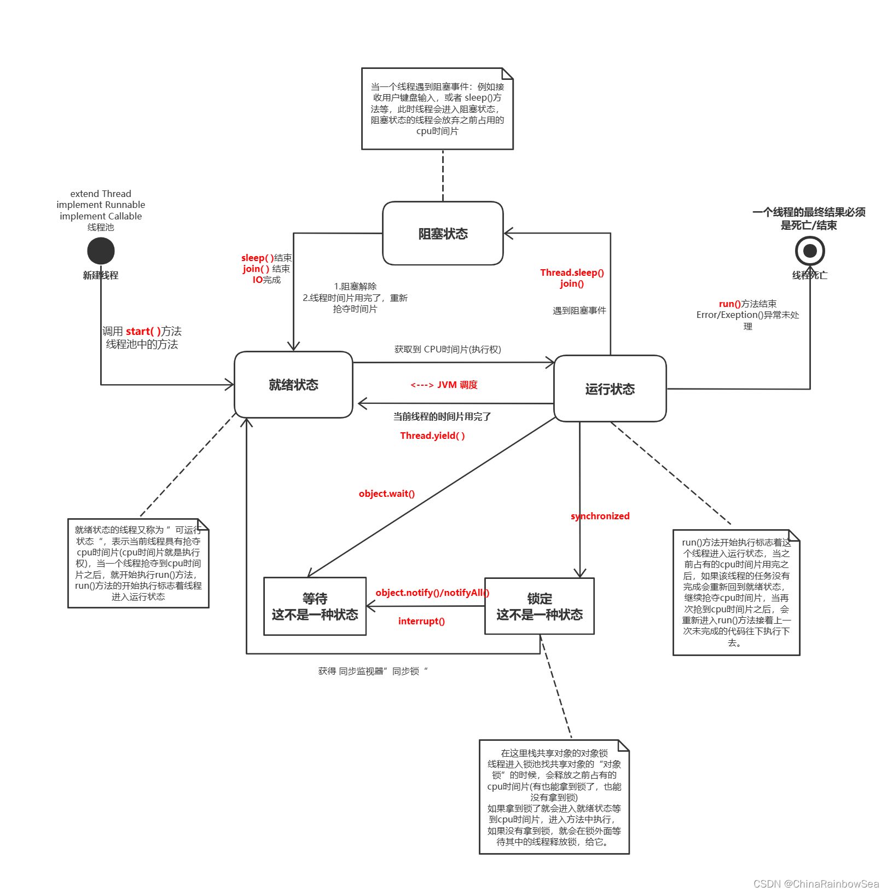

# `java`多线程基础

## 生命周期



生命周期说明


```
① 新建状态:
        使用new关键字创建一个Thread或其子类对象后,该线程对象保持新建状态,直到start()方法被调用.
② 就绪状态:
        当线程对象调用了start()方法后,线程进入就绪状态,此时等待CPU调度.
③ 运行状态:
        如果就绪状态线程获取到CPU资源,就可以执行run()方法,此时处于运行状态.
④ 阻塞状态:
       如果一个线程执行了sleep()方法后,失去占用的资源后,进入阻塞状态,如果睡眠时间已到或者获取到设备资源后,重新进入就绪状态,等待CPU调度.
       阻塞大致分为三种:
        1) 等待阻塞:运行状态执行wait()方法,进入等待阻塞.
        2) 同步阻塞:线程在获取synchronized同步锁失败(同                        步锁被其他资源占用)
        3) 其他阻塞:调用sleep()或join()发出I/O请求时,线程进入阻塞状态,当sleep()状态超时,join()等待线程终止或超时,线程重新进入就绪状态.
⑤ 死亡状态
       一个运行状态的线程完成任务或者其他终止条件发生时,该线程切换到终止状态.


```

## 线程的创建

- 方式1

```java
    /**
     * 通过继承Thread类,缺点:JAVA只支持单继承
     */
    static class Thread1 extends Thread{

        @Override
        public void run() {
            System.out.println("创建方式一:继承Thread类,重写run方法...");
        }
    }
```

- 方式2

```java

    /**
     *  通过实现Runnable接口,不能获取返回值,无法抛出显示异常
     */
    static class Thread2 implements Runnable{

        @Override
        public void run() {
            System.out.println("创建方式二:实现Runnable接口,重写run方法...");
        }
    }

```

方式3

```java

    /**
     *  可以抛出异常,也可以获取返回值
     */
    static class Thread3 implements Callable<Integer>{
        @Override
        public Integer call() throws Exception {
            System.out.println("创建方式三:实现Callable接口,重写call方法...");
            return 1;
        }
    }
```

